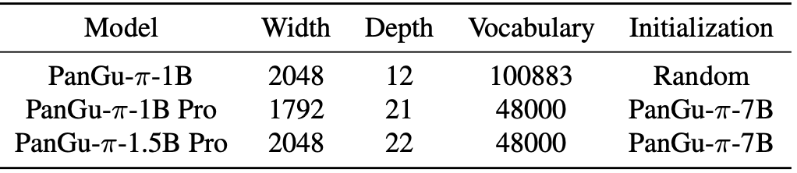

# Rethinking Optimization and Architecture for Tiny Language Models

Implementation for [Rethinking Optimization and Architecture for Tiny Language Models](https://arxiv.org/pdf/2402.02791.pdf). The power of large language models (LLMs) has been demonstrated through numerous data and computing resources. However, the application of language models on mobile devices is facing huge challenge on the computation and memory costs, that is, tiny language models with high performance are urgently required. Limited by the highly complex training process, there are many details for optimizing language models that are seldom studied carefully. In this study, based on a tiny language model with 1B parameters, we carefully design a series of empirical study to analyze the effect of each component. Three perspectives are mainly discussed, i.e., neural architecture, parameter initialization, and optimization strategy. Several design formulas are empirically proved especially effective for tiny language models, including tokenizer compression, architecture tweaking, parameter inheritance and multiple-round training. Then we train PanGu-π-1B Pro and PanGu-π-1.5B Pro on 1.6T multilingual corpora, following the established formulas. Experimental results demonstrate the improved optimization and architecture yield a notable average improvement of 8.87 on benchmark evaluation sets for PanGu-π-1B Pro. Besides, PanGu-π-1.5B Pro surpasses a range of SOTA models with larger model sizes, validating its superior performance.

PanGu-π Pro is constructed with severalarchitecture and optimization improvement methods, including compact tokenizer, architecture tweak, parameter inheritance, and multiple-round training.

<p align="center">

</p>


### Model Configure

<p align="center">

</p>

## Results

<p align="center">

</p>

## Train

This repository is modified from the [InternEvo](https://github.com/InternLM/InternEvo) training framework.

Here are the steps to train our models:

1. Clone the [InternEvo](https://github.com/InternLM/InternEvo) repository and configure the runtime environment.
2. Copy the configuration files `configs/LLM1B.py` to the `InternEvo/configs/` directory.
3. Copy the start script `start_finetune.py` to the `InternEvo` root directory.
4. Start finetune: `python start_finetune.py`

## Inference

Convert the model weight to huggingface format using the script `tools/transformers/convert2hf.py`.

Then inference with huggingface.

## Acknowledgements

- [InternLM/InternEvo](https://github.com/InternLM/InternEvo)
- [huggingface/transformers](https://github.com/huggingface/transformers)
- [google/sentencepiece](https://github.com/google/sentencepiece)
- [open-compass/opencompass](https://github.com/open-compass/opencompass)
- [EleutherAI/lm-evaluation-harness](https://github.com/EleutherAI/lm-evaluation-harness)

## Citation
```
@misc{tang2024rethinking,
      title={Rethinking Optimization and Architecture for Tiny Language Models}, 
      author={Yehui Tang and Fangcheng Liu and Yunsheng Ni and Yuchuan Tian and Zheyuan Bai and Yi-Qi Hu and Sichao Liu and Shangling Jui and Kai Han and Yunhe Wang},
      year={2024},
      eprint={2402.02791},
      archivePrefix={arXiv},
      primaryClass={cs.CL}
}
```